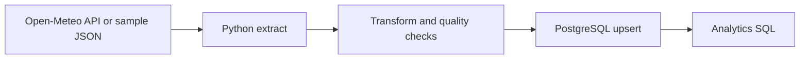

# Athens Weather ETL

A compact ETL project that extracts hourly weather data for Athens,
validates and transforms it in Python, and loads it into PostgreSQL with idempotent
upserts.

## What this project demonstrates

- **Extract:** Open-Meteo HTTP API or bundled deterministic JSON sample.
- **Transform:** type conversion, required-field checks, equal-array-length checks,
  humidity validation, non-negative precipitation validation.
- **Load:** PostgreSQL transaction and `INSERT ... ON CONFLICT DO UPDATE`.
- **Observability:** structured logs and an `etl_runs` audit table.
- **DevOps:** Dockerfile, Docker Compose health check, environment configuration,
  Makefile and GitHub Actions CI.
- **SQL:** aggregations, CTEs and a window function in `sql/analytics.sql`.

## Architecture



## Quick start

Requirements: Docker and Docker Compose.

```bash
cp .env.example .env
make demo
make query
```

`make demo` uses the bundled JSON file, so the demonstration does not depend on
network access.

To use the live API:

```bash
make live
make query
```

To prove idempotency, run the sample pipeline twice:

```bash
make demo
make demo
make query
```

The `weather_hourly` table still contains one row per `(location_name, observed_at)`;
the second run updates matching rows instead of creating duplicates.

## Useful commands

```bash
make help
make demo
make live
make query
make test
make lint
make reset
```

## Data model

### `weather_hourly`

The grain is **one location per hourly timestamp**. The composite primary key is:

```text
(location_name, observed_at)
```

That key makes repeated executions idempotent. Incoming values are inserted once or
updated when the same business key already exists.

### `etl_runs`

Stores one row per pipeline execution, including source mode, status, number of
processed rows, timestamps and an error message when a run fails.

## Repository structure

```text
.
├── .github/workflows/ci.yml
├── data/sample_open_meteo_response.json
├── docs/architecture.md
├── sql/001_create_tables.sql
├── sql/analytics.sql
├── src/weather_etl/
├── tests/test_transform.py
├── Dockerfile
├── docker-compose.yml
├── Makefile
└── pyproject.toml
```

## Design decisions and trade-offs

- **Why PostgreSQL?** It makes SQL, constraints, indexing, transactions and upserts
  visible in a small project.
- **Why no Airflow?** A scheduler would add infrastructure without improving the core
  demonstration. In production, this command could be scheduled by Airflow, Kubernetes
  CronJob, GitHub Actions or another orchestrator.
- **Why sample plus live mode?** The live mode proves integration; the sample mode makes
  demos and CI deterministic.
- **What would be next?** Incremental historical ingestion, staging tables, retries with
  exponential backoff, metrics, secrets management and deployment to Kubernetes.

## Source

Weather data is retrieved from Open-Meteo. No API key is required for this demo.
