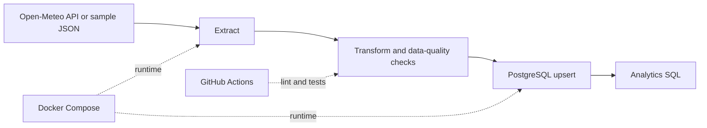

# Architecture

The pipeline is intentionally small, but it demonstrates production-oriented ideas:

- deterministic local execution with sample data;
- a live API mode;
- schema constraints and application-level quality checks;
- idempotent loading through a composite primary key and `ON CONFLICT`;
- an ETL run audit table;
- container health checks and CI.
